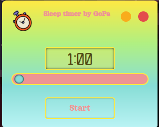

# Пет-проект sleep-timer.

sleep-timer - это таймер сна для десктопных устройств написанный на языке JavaScrip с использованием библиотеки Electron JS.

___

## Функционал

Данная программа отключает компьютер по таймеру.

## Инструкция по установке:

- Скачайте таймер сна по данной [ссылке](https://disk.yandex.ru/d/DPj6Xo6vTxdRYg);
- Распакуйте архив в любую удобную директорию;
- Запустите программу 'sleep-timer.exe'.

## Инструкция по использованию:

- При помощи ползунка поставьте нужное время;
- Нажмите 'Start'. По истечению времени ваш компьютер автоматически выключится;
- Что бы отменить таймер достаточно просто закрыть программу.

## Стек технологий:

          
